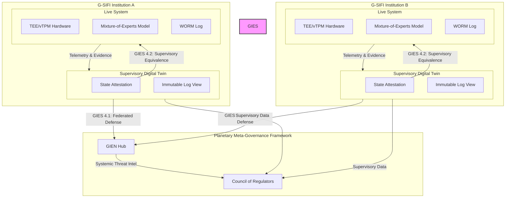

# GIES → SDT → PMGF: Integration & Canonical Reduction Chain

**Document ID:** `GIES-INTEGRATION-2026-06-27-v1.0`
**Status:** Finalized for Publication
**Classification:** Public Trust Artifact

---

## **1. Abstract**

This document provides the canonical integration model for the Sentinel AI Governance Stack. It illustrates the flow of authority and evidence from the foundational Governance Integrity Ecosystem Specification (GIES) to the live operational environment and up to the supervisory and planetary-scale governance layers. It makes explicit the **Canonical Reduction Chain**, demonstrating that all supervisory knowledge is a verifiable derivation of the system's constitutional invariants.

---

## **2. The Integration Diagram**

The following diagram illustrates the relationship between the Live System, the Supervisory Digital Twin (SDT), and the Planetary Meta-Governance Framework (PMGF).

---

## **3. The Canonical Reduction Chain**

The Canonical Reduction Chain ensures that every supervisory judgment is grounded in verifiable evidence that is constitutionally linked to the system's foundational principles. A supervisor never has to "trust" a summary; they can always trace the chain of evidence back to the GIES invariants.

**A Supervisor asks: "Is the entire federated system compliant?"**

1.  **Level 4 (Planetary): The PMGF View**
    *   The **Regulator's Council** observes the **Cross-Institution Dashboard**.
    *   The dashboard shows all federated nodes as **Green**.
    *   **WHY?** Because each node's Supervisory Digital Twin is providing a valid, signed **Governance State Attestation**.

2.  **Level 3 (Supervisory): The Supervisory Digital Twin (SDT)**
    *   A supervisor drills down into a specific institution's **SDT**.
    *   The SDT attests that the live system is compliant.
    *   **WHY?** Because it has successfully ingested and verified all **Evidence Objects** (e.g., zk-proofs of model compliance, hardware attestations, policy evaluation logs) from the live system. This fulfills **GIES Invariant 4.2 (Supervisory Equivalence)**.

3.  **Level 2 (Operational): The Governance Execution Environment (GEE)**
    *   The supervisor examines the evidence within the SDT.
    *   A **zk-SNARK proof** shows that a proprietary MoE model correctly adhered to a public fairness policy.
    *   **WHY?** Because the live system's GEE is architected to produce these proofs as a non-negotiable part of its operation. The system cannot perform an action *without* generating the corresponding evidence. This fulfills **GIES Invariant 2.2 (Zero-Knowledge Governance)** and **GIES Invariant 3.2 (MoE Stability)**.

4.  **Level 1 (Constitutional): The Governance Integrity Meta-Model (GIMM)**
    *   The supervisor asks the ultimate question: "Can I trust this evidence?"
    *   **YES.** Because the evidence object itself was written to an immutable WORM log, and the entire process is governed by the foundational axioms of the GIES.
    *   The existence of the evidence object fulfills **GIES Invariant 1.1 (The Axiom of Verifiable Integrity)**.
    *   The inability to tamper with that evidence fulfills **GIES Invariant 1.2 (The Axiom of Immutability)**.

**Conclusion:** The supervisor's confidence in the "Green" light on their dashboard is not a matter of trust in a vendor or an institution. It is a matter of verifying a complete, unbroken, and cryptographically secured chain of evidence that begins with the system's constitution and ends with a single, verifiable signal. This is the essence of **Governance-State Attestation**.
