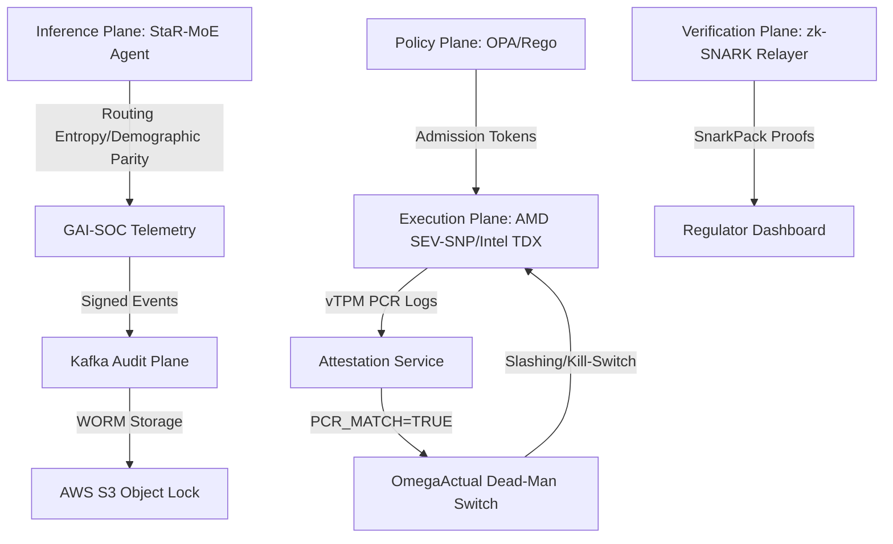

# Sentinel AI Governance Dashboard: UX & Technical Roadmap (2026–2035)

## 1. Vision & Executive Summary
This roadmap defines the implementation of a high-assurance React-based dashboard designed for G-SIFI (Global Systemically Important Financial Institutions) AI oversight. The dashboard transitions from simple observability to autonomous, hardware-rooted containment and zero-knowledge regulatory reporting for AGI/ASI ecosystems.

---

## 2. Technical Stack Recommendation

### Frontend (High-Assurance UI)
- **Framework**: React 19+ with Next.js (App Router) for SSR/ISR.
- **Styling**: Tailwind CSS + Radix UI Primitives (for accessibility/AIGOV-05 compliance).
- **State Management**: TanStack Query (Server State) + Zustand (Client State).
- **Visualization**: Apache ECharts (for high-frequency telemetry) + Mermaid.js (for TLA+ state machine & lineage visualization).
- **Security**: Content Security Policy (CSP) with strict nonce-based execution; vTPM-bound session tokens.

### Backend (The Audit & Policy Plane)
- **Primary API**: FastAPI (Python) or Node.js (Express/Deno) for low-latency governance gates.
- **Policy Engine**: Open Policy Agent (OPA) running as a sidecar for Rego evaluation.
- **Audit Storage**: Kafka (Event Fabric) -> AWS S3 with Object Lock (COMPLIANCE mode) for PQC-WORM evidence.
- **Cryptography**: `pqc_worm_logger.py` integrating ML-DSA-65 and CRYSTALS-Dilithium.
- **Formal Verification**: TLA+ runtime monitors for invariant checking (`SentinelContainmentProtocol.tla`).

---

## 3. Phased Implementation Milestones

### Milestone 1: Foundational Trust & WORM Observability (Q3 2026)
*Focus: Hardware-rooted identity and immutable evidence.*

- **Hardware Attestation UX**: Real-time vTPM/TEE status map showing `PCR_MATCH=TRUE` status across the G-Stack compute nodes.
- **WORM Audit Explorer**: Time-series view of signed audit batches with Merkle-root verification UI.
- **Systemic Risk Pulse**: Initial G-SRI dashboard showing CPU/Memory vs. Risk thresholds.
- **Dependency**: `pqc_worm_logger.py` and `tee_tpm_attestation.go` implementation.

### Milestone 2: Compliance-as-Code & OPA Tooling (Q1 2027)
*Focus: Moving from manual checklists to real-time policy enforcement.*

- **Rego Policy IDE**: In-browser editor for OPA policies with "Dry-Run" simulator against historical telemetry.
- **Annex IV Dossier Factory**: Automatic assembly of EU AI Act technical documentation from telemetry traces.
- **Mapping Visualization**: interactive matrix linking technical OPA rules to NIST AI RMF and SR 26-2 controls.
- **Dependency**: Milestone 1 Audit trails; OPA sidecar deployment.

### Milestone 3: StaR-MoE & EAIP Simulation (Q4 2027)
*Focus: Managing emergent behavior in Mixture-of-Experts financial agents.*

- **MoE Routing Heatmap**: Visualizing expert activation, Shannon Routing Entropy ($H_{sh}$), and Alignment Resonance ($C_{res}$).
- **EAIP Simulator**: "Chaos Engineering" UI to inject adversarial signals and verify Enterprise AI Agent Interoperability Protocol (EAIP) containment.
- **Red Dawn Scenario Runner**: Workflow UX to trigger `Rogue-Yield-Subroutine-99` simulations and record MTTC (Mean Time to Contain).
- **Dependency**: StaR-MoE stabilization layer (SARA/ACR).

### Milestone 4: Zero-Knowledge & OSCAL Automation (2028–2030)
*Focus: Global supervisory interoperability without data leakage.*

- **ZK-Proof Aggregator**: Dashboard for SnarkPack-aggregated compliance proofs for Basel III/IV.
- **OSCAL Export Engine**: One-click generation of machine-readable NIST 800-53/OSCAL 1.1.2 catalogs for regulators.
- **Collective Defense UI**: SIP v3.0 federated risk signal sharing across GIEN institutions.
- **Dependency**: Circom/Groth16 circuits for systemic risk; SIP v3.0 protocol.

---

## 4. Feature Groups & Priorities

| Feature Group | Priority | Target Audience | Primary Metric |
|---------------|----------|-----------------|----------------|
| **Hardware Trust** | P0 | Platform Ops | % Nodes Attested |
| **Audit Integrity** | P0 | Compliance/Audit | PQC Signature Verification |
| **Policy Control** | P1 | Risk Managers | OPA Gate Bypass Count (Goal: 0) |
| **Risk Visualization**| P1 | Board/CRO | G-SRI vs. Threshold |
| **Simulation** | P2 | Red Teams | MTTC (Goal: < 2s) |
| **Interop/OSCAL** | P2 | Regulators | Time to Report Delivery |

---

## 5. Engineering Implementation Guidance

1. **Safety-First UI**: Never allow high-risk actions (e.g., policy overrides) without dual cryptographic authorization (multi-sig) rendered in the dashboard.
2. **Telemetry Aggregation**: Use SnarkPack for ZK-proofs to reduce frontend-to-backend payload size during heavy systemic stress periods.
3. **Formal Parity**: Ensure the dashboard's state transitions match the `SentinelContainmentProtocol.tla` invariants.
4. **Resilient UX**: The dashboard must remain operational via air-gapped EKS failover during `OMNI-BLACK` crisis scenarios.

---
**Version**: 1.0.0
**Status**: DRAFT FOR ARCHITECTURE REVIEW
**Ref**: Sentinel AI Governance v2.4 Stack

## 6. Reference Architecture & Workflow UX

### 6.1 Unified Governance Data Flow

### 6.2 Workflow UX: The G-SIFI Control Cockpit
1. **The Pulse (L1)**: Global G-SRI heat-map with real-time stability metrics ($C_{res}$, $H_{sh}$).
2. **The Vault (L2)**: Explorer for PQC-signed WORM audit logs with legal-hold capabilities.
3. **The Gating Engine (L3)**: Visual OPA policy debugger and Annex IV document generator.
4. **The Collective (L4)**: SIP v3.0 interface for inter-institutional "GIEN" collective defense signals.

### 6.3 Implementation Best Practices
- **Standardization**: Adhere to ISO/IEC 42001 (AIMS) for dashboard lifecycle management.
- **Explainability**: Integrate Contextual Attribution Envelopes (CAE) into the UI for GDPR Article 22 compliance.
- **Resilience**: Ensure the frontend can operate in "Offline-First" mode during systemic connectivity failures (DORA compliance).

---
**Prepared by**: AI Governance Architecture Team
**Confidentiality**: Level 4 - Restricted
