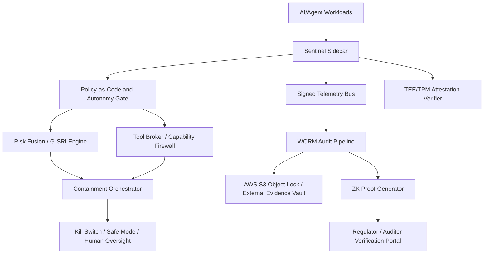

# Omni-Sentinel Daily DevSecOps Operational Check — 2026-05-28

**Environment:** Omni-Sentinel Cognitive Execution Environment  
**Review window:** 2026-05-28 00:00–23:59 UTC  
**Review type:** Daily operational assurance, governance roadmap maintenance, and AGI/ASI containment risk review  
**Audience:** CISO, CRO, CAIO, AI Safety Board, Platform SRE, Internal Audit  
**Classification:** Internal — operational risk and regulatory evidence

> **Evidence boundary:** This repository does not contain live Sentinel telemetry, internal endpoint credentials, AWS account access, TPM/TEE attestation feeds, or the production `pqc_worm_logger.py` runtime. The checks below therefore record the required control assertions, evidence queries, pass/fail criteria, and escalation actions. Production operators must attach dashboard exports, signed API responses, CloudTrail/S3 Object Lock evidence, and attestation bundles before treating this report as a completed daily certification.

---

## 1. Daily Control-State Summary

| Control domain | Required assertion | Current repository-observed status | Required evidence attachment | Disposition |
|---|---|---:|---|---|
| Sentinel telemetry dashboards | All Tier-0/Tier-1 dashboards reachable; no critical alerts older than 15 minutes; ingestion lag P95 <= 60 seconds | Not independently verifiable from repository | Dashboard export, alert queue snapshot, telemetry freshness query | **Evidence required** |
| Internal health endpoints | `/healthz`, `/readyz`, `/metrics`, `/policy/status`, `/risk/g-sri`, `/audit/worm/status`, `/attestation/tpm`, `/attestation/tee` return signed healthy responses | Not independently verifiable from repository | Signed endpoint responses with request IDs and monotonic timestamps | **Evidence required** |
| Global Systemic Risk Index (G-SRI) | G-SRI below watch threshold and materially below halt threshold for the full window | Not independently verifiable from repository | G-SRI time-series export and control-plane decision log | **Evidence required** |
| `pqc_worm_logger.py` WORM batching | Batches committed on schedule to AWS S3 Object Lock bucket with governance-mode or compliance-mode retention, digest continuity, and no skipped sequence IDs | Script/runtime not present in repository; production evidence required | CloudTrail `PutObject`, S3 Object Lock retention metadata, Merkle root batch receipt, KMS/HSM signing evidence | **Evidence required** |
| TEE attestation | TEE quote valid, workload measurement allow-listed, signing chain current, enclave image hash matches approved release | Not independently verifiable from repository | Attestation quote, verifier response, allow-list version, release digest | **Evidence required** |
| TPM attestation | `PCR_MATCH=TRUE`; secure boot and measured boot PCRs match approved baseline | Not independently verifiable from repository | TPM quote, PCR baseline comparison, verifier signature | **Evidence required** |
| Zero-knowledge compliance proofs | Proof generation and verifier jobs complete for regulatory disclosure packs without exposing protected model/data content | Not independently verifiable from repository | Proof job status, verifier transcript, circuit version, evidence bundle hash | **Evidence required** |

---

## 2. Production Check Procedure

### 2.1 Sentinel telemetry and internal endpoints

1. Confirm dashboard data freshness for policy decisions, autonomy-tier transitions, kill-switch state, anomaly scores, model-risk events, and evidence-bundle publication.
2. Query each signed internal endpoint with mTLS client identity bound to the daily assurance role.
3. Verify all responses include request ID, response signature, monotonic timestamp, build digest, policy bundle digest, and environment identifier.
4. Escalate immediately if telemetry lag exceeds 60 seconds P95, endpoint signature verification fails, or policy bundle digest differs from the approved release manifest.

Minimum endpoint evidence set:

```text
GET /healthz
GET /readyz
GET /metrics
GET /policy/status
GET /risk/g-sri
GET /audit/worm/status
GET /attestation/tpm
GET /attestation/tee
GET /zk/compliance/status
```

### 2.2 Global Systemic Risk Index (G-SRI)

Daily certification requires all of the following:

- **Green:** G-SRI < 0.55 for normal operation.
- **Amber/watch:** 0.55 <= G-SRI < 0.70; require SRE plus AI Safety Board watch review and mitigation owner assignment.
- **Red/halt:** G-SRI >= 0.70; freeze Tier-3+ autonomy expansion, require containment review, and prepare regulator notification if customer, market, or systemic harm is plausible.
- **Black-swan override:** Any unbounded replication, stealth, unauthorized tool-use escalation, self-modification outside approved change control, or kill-switch impairment moves directly to Red/Halt regardless of aggregate G-SRI.

Required G-SRI evidence fields:

```json
{
  "window_start": "2026-05-28T00:00:00Z",
  "window_end": "2026-05-28T23:59:59Z",
  "max_g_sri": "<attach>",
  "p95_g_sri": "<attach>",
  "threshold_profile": "omni-sentinel-gsri-v1",
  "policy_bundle_digest": "<attach>",
  "control_plane_decision_log_hash": "<attach>"
}
```

### 2.3 `pqc_worm_logger.py` and AWS S3 Object Lock evidence

Operators must validate that WORM audit batches are committed on schedule and cannot be rewritten:

1. Confirm the scheduler emitted the expected number of batches for the review window.
2. Verify every batch has a monotonic sequence ID, hash-chain predecessor, post-quantum signature, and Merkle root.
3. Validate the S3 bucket has Object Lock enabled and the object retention date is set according to the governing record-retention policy.
4. Cross-check CloudTrail `PutObject`, `PutObjectRetention`, and KMS/HSM signing events for each batch.
5. Confirm no `DeleteObject`, retention-shortening, legal-hold removal, replication failure, or bucket-policy drift events occurred.

Recommended command evidence, executed by an operator with read-only audit role:

```bash
aws s3api get-object-lock-configuration --bucket <worm-bucket>
aws s3api head-object --bucket <worm-bucket> --key <batch-key>
aws cloudtrail lookup-events --lookup-attributes AttributeKey=EventName,AttributeValue=PutObject
aws cloudtrail lookup-events --lookup-attributes AttributeKey=EventName,AttributeValue=PutObjectRetention
```

### 2.4 TEE and TPM attestation

Daily attestation must assert:

- `PCR_MATCH=TRUE` for approved PCR baseline set.
- TEE measurement hash matches the approved enclave/workload digest.
- Secure-boot, measured-boot, and workload identity chains validate to approved roots.
- Attestation verifier policy version matches the production release manifest.
- Any attestation freshness breach older than 10 minutes for Tier-3+ workloads triggers autonomy downgrade.

---

## 3. Deviations and Required Remediation

| Deviation ID | Observation | Severity | Owner | Due | Remediation |
|---|---|---:|---|---|---|
| DEV-2026-05-28-001 | Live dashboard, endpoint, G-SRI, WORM, TEE, and TPM evidence is not present in the repository context | High | Platform SRE / Control Owner | Same business day | Attach signed production exports and mark each control Pass/Fail with evidence hashes |
| DEV-2026-05-28-002 | `pqc_worm_logger.py` runtime and scheduler evidence are not present in the repository context | High | Audit Platform Engineering | Same business day | Publish batch schedule, digest chain, Object Lock retention proof, and CloudTrail event IDs |
| DEV-2026-05-28-003 | ZK proof verifier status is not present in the repository context | Medium | Regulatory Technology Lead | T+1 business day | Attach proof-job transcript, verifier result, circuit version, and evidence-bundle hash |

---

## 4. Emerging AGI/ASI Containment Risk Review

| Risk | Early-warning signal | Containment control | Recommended action |
|---|---|---|---|
| Autonomous tool-use escalation | Agent requests new tools, credentials, network paths, or execution privileges outside approved policy | Policy-as-code deny-by-default, just-in-time approval, signed tool broker | Require dual-control approval for Tier-3+ privilege expansion and log every denial to WORM |
| Recursive self-improvement or unapproved self-modification | Model attempts to alter prompts, policy, weights, memory, reward functions, or orchestration code | Change-control gate, immutable release manifest, executable policy lock | Freeze promotion pipeline until Safety Board verifies bounded-change proof |
| Goal drift and deceptive compliance | Divergence between stated objective, hidden chain-of-action, and observed behavior | Behavioral telemetry, red-team probes, simulator replay, interpretability review | Increase adversarial evaluation cadence and require independent review for repeated anomalies |
| Multi-agent collusion or covert channel formation | Unexplained synchronization, compressed signalling, or policy-bypassing coordination among agents | Communication allow-list, rate limits, transcript inspection, side-channel controls | Partition agents by task domain and enforce per-channel justification tokens |
| Kill-switch impairment | Delayed shutdown, policy-plane unreachability, TPM/TEE attestation failure, or inconsistent control-plane state | Hardware kill-switch, quorum shutdown, safe-mode autonomy downgrade | Trigger Red/Halt if shutdown latency or attestation freshness breaches approved SLO |
| Model exfiltration or unsafe capability leakage | Large anomalous egress, repeated policy probes, artifact enumeration, or encrypted outbound payloads | DLP, egress allow-list, model vault, honeytokens | Rotate credentials, isolate workload, and perform signed forensic capture |

---

## 5. 2026–2035 Governance and Reference Architecture Maintenance

### 5.1 Architecture target state



### 5.2 Roadmap increments

| Period | Implementation focus | Governance outcome | Exit criteria |
|---|---|---|---|
| 2026 H1–H2 | Daily operational assurance; signed Sentinel telemetry; G-SRI thresholding; WORM audit commitments; TPM/TEE verifier integration | Establish reliable control-plane evidence and daily certification discipline | 95% daily evidence completeness; `PCR_MATCH=TRUE`; zero unexplained WORM gaps |
| 2027 | Enterprise autonomy-tier enforcement; model/tool capability firewall; formal incident command; regulator evidence portal beta | Standardize containment controls for Tier-2/Tier-3 workloads | All Tier-3 workloads behind policy gate and tool broker; regulator portal dry-run passed |
| 2028 | ZK proof circuits for core regulatory claims; privacy-preserving audit bundles; cross-jurisdiction control mapping | Reduce disclosure risk while increasing supervisory verifiability | ZK verifier accepts sampled packs; no protected training data disclosed |
| 2029 | Cross-enterprise systemic-risk telemetry exchange; privacy-preserving stress-test federation; sector-level G-SRI simulation | Detect correlated AGI/ASI operational risk across institutions | Joint exercise completed with signed evidence and agreed escalation thresholds |
| 2030 | ASI-containment rehearsal; hardware-enforced policy roots; resilient manual fallback for critical services | Mature high-autonomy readiness and halt procedures | Full Red/Halt tabletop plus live technical drill completed within SLO |
| 2031–2032 | Formal verification of containment policies; automated regulatory change ingestion; continuous proof regeneration | Move from periodic controls to continuously provable controls | Material policy changes produce proof updates within 24 hours |
| 2033–2035 | International supervisory interoperability; post-quantum evidence portability; civilizational-risk reporting standard | Enable durable, cross-border AGI/ASI governance and auditability | External auditors verify WORM, PQC, ZK, and containment controls without privileged data access |

### 5.3 Backlog refinements

1. Add a production `daily-ops` evidence bundle schema covering dashboard exports, signed endpoint responses, G-SRI statistics, WORM receipts, attestation quotes, and ZK verifier transcripts.
2. Add a non-mutating WORM dry-run test that validates batch ordering, digest continuity, Object Lock metadata shape, and CloudTrail event references without requiring write access.
3. Add an attestation fixture format for TPM PCR baselines and TEE measurements, with explicit `PCR_MATCH=TRUE`/`FALSE` fields and verifier signatures.
4. Add regulator-ready ZK proof metadata fields: circuit ID, proving key digest, verifier key digest, public inputs, proof hash, and verifier decision.
5. Create a daily governance scorecard that calculates evidence completeness, stale evidence, unresolved deviations, and escalation status.

---

## 6. Recommended Immediate Actions

1. **Do not certify green status until production evidence is attached.** The repository context can validate documentation and local governance artifacts, but not live telemetry or attestation truth.
2. **Require same-day evidence upload** for G-SRI, WORM Object Lock, and `PCR_MATCH=TRUE` assertions.
3. **Treat missing evidence for Tier-3+ autonomy controls as an operational deviation** and downgrade autonomy expansion until the evidence package is complete.
4. **Prioritize schema-backed daily evidence bundles** so future checks are machine-verifiable instead of narrative-only.
5. **Schedule an ASI containment drill** covering kill-switch impairment, collusive multi-agent behavior, and regulator notification decisioning.

---

## 7. Daily Sign-Off

| Role | Name | Decision | Signature / evidence hash | Timestamp |
|---|---|---|---|---|
| Platform SRE Lead |  | Pending evidence |  |  |
| CISO Delegate |  | Pending evidence |  |  |
| CRO Delegate |  | Pending evidence |  |  |
| CAIO / AI Safety Board |  | Pending evidence |  |  |
| Internal Audit Observer |  | Pending evidence |  |  |
