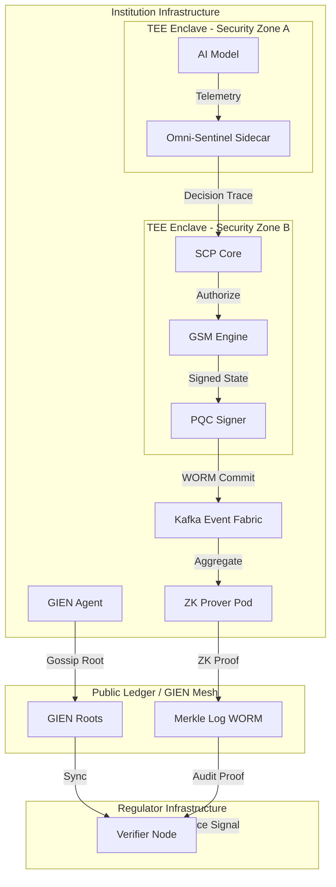

# G-SIFI 2028 Supervisory Pilot Blueprint

## 1. System Overview

The 2028 Pilot focuses on the deployment of a federated supervisory nervous system across three major G-SIFI nodes and a central Regulator Verifier Node.

## 2. Infrastructure: Kubernetes Pod Layouts

### SCP Core Pod (Enclave)
- **Container 1 (scp-core):** Primary orchestration logic.
- **Container 2 (gsm-engine):** Governance State Machine execution.
- **Container 3 (pqc-signer):** ML-DSA signature service.

### ZK Prover Pod
- **Container 1 (prover):** SnarkJS-based proof generation.
- **Container 2 (evidence-binder):** Aggregates witnesses for ZK circuits.

### GIEN Agent Pod
- **Container 1 (sip-client):** Implements SIP v3.0 gossip and anchoring.
- **Container 2 (root-fetcher):** Syncs roots from GIEN Roots.

## 3. Enclave Boundaries and Hardware Root of Trust

- **Security Zone A (Confidential):** Model weights and decision logic (Intel TDX).
- **Security Zone B (Governance):** GSM state, private keys, and evidence witnesses (AMD SEV-SNP).
- **Security Zone C (Public):** Signed Merkle roots and ZK proofs.

## 4. Kafka Topics and Data Flow

- `governance.events.raw`: Internal high-fidelity telemetry (Encrypted).
- `governance.events.signed`: PQC-signed audit trail (WORM).
- `governance.proofs.pending`: Witnesses ready for ZK proving.
- `governance.roots.public`: Merkle roots shared via SIP v3.0.

## 5. Regulator Verification Workflow

Regulators operate **Verifier Nodes** that independently confirm institutional compliance:
1. **Root Verification:** Verify Merkle root signatures against institutional PQC public keys.
2. **Proof Verification:** Verify ZK proofs against public Merkle roots and policy hashes.
3. **Liveness Check:** Monitor "Containment Heartbeats" to ensure active oversight.

Regulators can verify *that* a policy was followed without seeing the *content* of the telemetry.

## 6. Visual Architecture (Mermaid)

