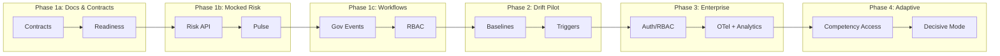

# Strategy Map: Phases × Transformation Dimensions

```mermaid
flowchart LR
  subgraph Phase_1a[Phase 1a: Docs & Contracts]
    A[Contracts] --> B[Readiness]
  end
  subgraph Phase_1b[Phase 1b: Mocked Risk]
    C[Risk API] --> D[Pulse]
  end
  subgraph Phase_1c[Phase 1c: Workflows]
    E[Gov Events] --> F[RBAC]
  end
  subgraph Phase_2[Phase 2: Drift Pilot]
    G[Baselines] --> H[Triggers]
  end
  subgraph Phase_3[Phase 3: Enterprise]
    I[Auth/RBAC] --> J[OTel + Analytics]
  end
  subgraph Phase_4[Phase 4: Adaptive]
    K[Competency Access] --> L[Decisive Mode]
  end
  B --> C
  D --> E
  F --> G
  H --> I
  J --> K
```
